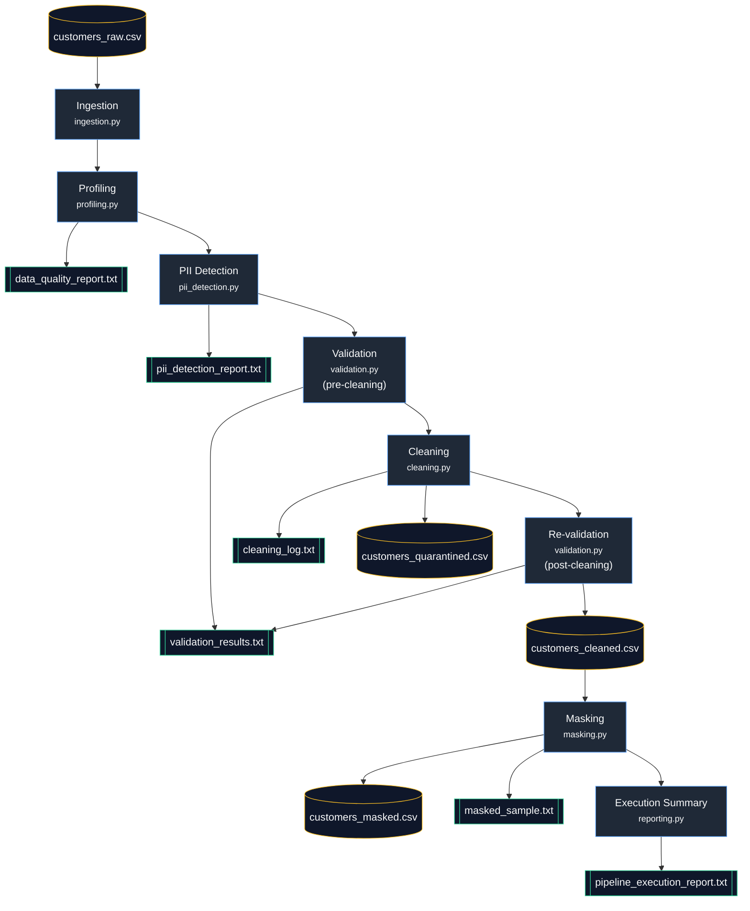
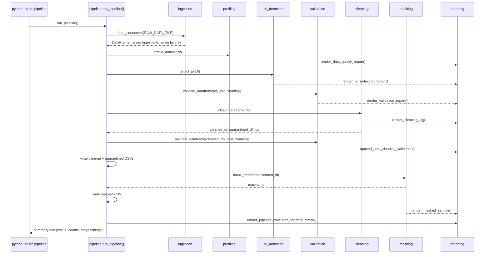
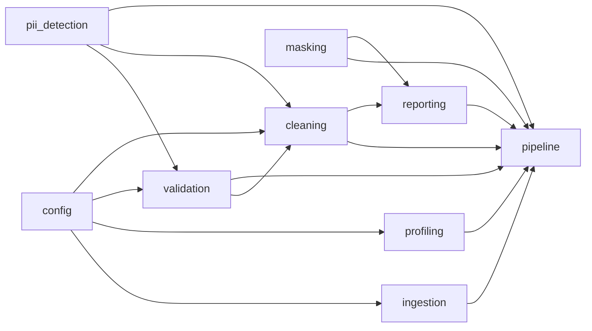

# Architecture

## Overview

This is a linear, single-run batch pipeline: one CSV goes in, and a set of
cleaned/masked/quarantined datasets and audit reports come out. There is
no scheduler, queue, or DAG framework involved — `src/pipeline.py` is the
composition root that calls every stage, in order, once per run.

## Data Flow



**Legend:** blue = processing stage, yellow = CSV dataset, green = text
report.

## Execution Sequence



Every stage is wrapped in a narrow `try/except` (`IngestionError`,
`ValueError`/`KeyError`, or `OSError` depending on what that stage can
actually raise) and re-raised as `PipelineError` with a specific message
— there is no bare `except:` anywhere in the codebase.

## Module Responsibilities

| Module | Responsibility | Depends on |
|---|---|---|
| `config.py` | Paths and tunable constants, env-var overridable. | — |
| `generate_dataset.py` | Builds the synthetic dataset with a documented, seeded error inventory. | `config` |
| `ingestion.py` | Loads and schema-checks the raw CSV. | `config` |
| `profiling.py` | Part 1 data-quality analysis. | `config` |
| `pii_detection.py` | Part 2 PII classification + regex detection (`EMAIL_PATTERN`/`PHONE_PATTERN`, reused by validation/cleaning). | — |
| `validation.py` | Part 3 per-row rule validation; single source of truth for "is this row valid," called both pre- and post-cleaning. | `config`, `pii_detection` |
| `cleaning.py` | Part 4 normalization + quarantine. | `config`, `validation`, `pii_detection` |
| `masking.py` | Part 5 masking functions. | — |
| `reporting.py` | Renders every `.txt` report from real computed results — no hand-written numbers. | `cleaning`, `masking`, `validation` (types only) |
| `pipeline.py` | Part 6 orchestration: logging, per-stage timing, error handling, wiring every stage together. | all of the above |



`pipeline.py` is the only module that imports everything; every other
module is a plain function/dataclass library with no side effects beyond
what it's explicitly asked to write, which is what makes each one
independently unit-testable (see `tests/`).

## Repository Layout

```
pii-data-quality-validation-pipeline/
├── src/                  # pipeline source (see table above)
├── tests/                # pytest suite, one file per module + integration
├── data/                 # customers_raw.csv (generated, seeded)
├── outputs/              # cleaned / masked / quarantined CSVs
├── reports/              # all six required .txt reports
├── docs/                 # architecture.md (this file), data_governance.md
├── logs/                 # pipeline.log (git-ignored; .gitkeep tracked)
├── reflection.md
├── README.md
├── Makefile              # make help for the full target list
├── Dockerfile / docker-entrypoint.sh / .dockerignore
├── requirements.txt
└── .gitignore / .env.example
```

## Validation Boundaries

Validation runs **twice** against the exact same rule set
(`validate_dataframe()`): once on the raw data (to measure how bad the
input is) and once on the cleaned data (to prove cleaning actually
worked, rather than just claiming it did). Cleaning does not duplicate
the rules — it normalizes, then calls the same validator and quarantines
whatever still fails.

## Output Strategy

Three CSVs come out of the pipeline, each with a distinct audience:

| File | Audience | Contains PII? |
|---|---|---|
| `outputs/customers_cleaned.csv` | Internal analytics needing full fidelity | Yes |
| `outputs/customers_masked.csv` | Broader analytical access | Reduced (see masking rules) |
| `outputs/customers_quarantined.csv` | Data-quality review / audit | Yes — same access tier as cleaned |

Reports (`reports/*.txt`) are safe for the widest audience: counts,
classifications, and (because this dataset is synthetic) customer IDs as
row identifiers — never full records.

## Performance & Observability

No code profiler (`cProfile`, `line_profiler`) is used — this is a
sub-second batch job over a few hundred rows, where per-line CPU
profiling wouldn't add much. What *is* tracked is wall-clock duration per
stage (`_stage_timer` in `pipeline.py`), logged and included in
`pipeline_execution_report.txt` — the practically useful equivalent of a
profiler at this scale, and enough to spot a stage that starts taking
disproportionately long as the dataset grows.

Structured logs go to both stdout and `logs/pipeline.log`. Every log line
is a count, a file path, a row number, or a stage name — never a raw PII
value.
